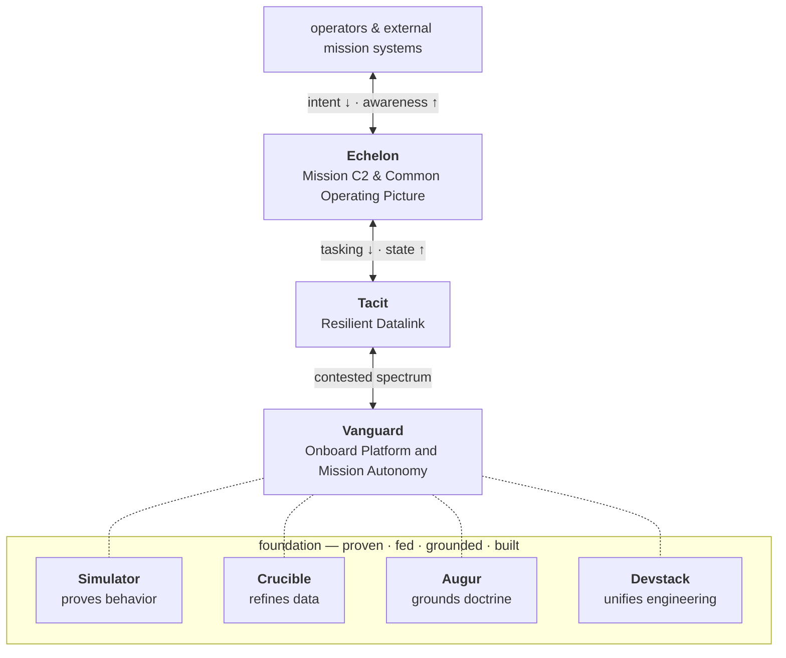

# Thyraen Robotics

**Mission-centric autonomy for contested and degraded environments.**

Thyraen Robotics builds autonomous systems that turn commander's intent into coordinated
operational effects — across heterogeneous platforms and sensors, in environments where
communications are unreliable, spectrum is contested, and conditions change faster than
pre-planned workflows can keep up. Our systems keep the warfighter heads-up and in the
fight, compressing decision-to-effect timelines without adding cognitive burden.

[thyraen-robotics.github.io](https://thyraen-robotics.github.io/) ·
[contact@thyraen.ai](mailto:contact@thyraen.ai) ·
Sierra Vista, Arizona

## The product ecosystem

| Product | What it is |
|---|---|
| **[Vanguard](https://thyraen-robotics.github.io/products/vanguard/)** | Onboard autonomy and mission-computer runtime for unmanned systems |
| **[Echelon](https://thyraen-robotics.github.io/products/echelon/)** | Situational awareness and tasking control plane for heterogeneous platforms |
| **[Tacit](https://thyraen-robotics.github.io/products/tacit/)** | Low-probability-of-detection datalink for contested spectrum |
| **[Dissident](https://thyraen-robotics.github.io/products/dissident/)** | Vendor-free drone video reception and redistribution to the tactical map |
| **[Simulator](https://thyraen-robotics.github.io/products/simulator/)** | Photoreal simulation and testbed environment for autonomy development |
| **[Crucible](https://thyraen-robotics.github.io/products/crucible/)** | Provenance-tracked data refinery for training-ready datasets and deployable models |
| **[Augur](https://thyraen-robotics.github.io/products/augur/)** | Doctrine knowledge graph and cited analysis thought-partner |
| **[Devstack](https://thyraen-robotics.github.io/products/devstack/)** | Shared engineering platform powering every Thyraen repository |

## How it fits together

One integrated capability stack, built on modular open-systems principles: each product
integrates through defined, versioned interfaces, platform specifics stay isolated from
mission-level autonomy, and every capability is proven in simulation before it reaches
hardware.

Dissident complements the stack from the side: it brings COTS video feeds into the
common operating picture without any vendor software in the loop.

## Design philosophy

- **Mission over platform** — autonomy exists to serve operational outcomes
- **Contracts over coupling** — typed, versioned boundaries; reject-only validation;
  integration without fragility
- **Human intent first** — operators define goals and limits; autonomy optimizes execution
- **Resilience by default** — degraded comms, contested spectrum, and denied environments
  are the design center, not the exception
- **Honest capability claims** — implemented substrate is kept explicitly distinct from
  ratified targets, in code and in documentation

## Working with Thyraen

Built for the Department of War and allied defense organizations that need autonomy
transitioned from experimentation to operational reality:

- **Architecture alignment** — domain model aligned with the Army's Next Generation C2
  (NGC2) architecture; designed to integrate with external mission systems such as
  Anduril Lattice
- **Interoperability first** — TAK, Cursor-on-Target, ADS-B, AIS, MAVLink/PX4,
  RTSP/H.264, and WebRTC
- **Closed-network ready** — airgap-capable deployments with native binaries and
  on-premises inference; no cloud dependency on the target
- **Simulation-validated** — thousands of repeatable flights with gated validation
  evidence before hardware

Reach us at [contact@thyraen.ai](mailto:contact@thyraen.ai), or start with the
[website](https://thyraen-robotics.github.io/).
